# FTracker
### Built with
* [![Swift][Swift]][Swift-url]
* [![Spring][SpringBoot]][SpringBoot-url]
* [![Python][Python.py]][Python-url]
* [![Postgres][Postgresql]][Postgresql-url]
* [![java][Java]][Java-url]

# About the Project

This is a budgeting tool, to assist users in keeping track of their expenses. It has a chat bot implemented to assist users with setting up budgets, gaining insights into their spending and helping users plan for the future.

### Features:
#### Landing page

  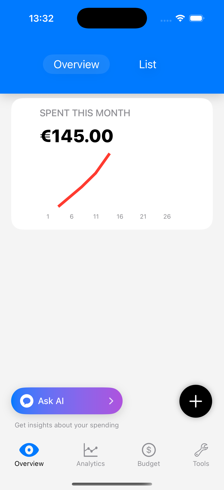
  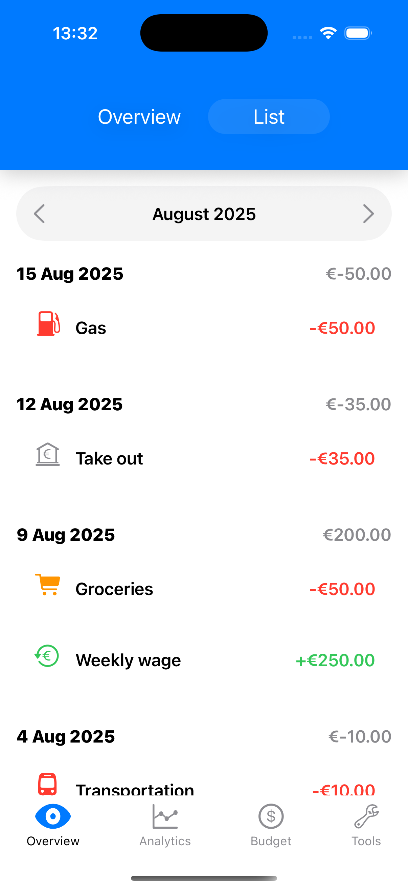

#### Analytics

  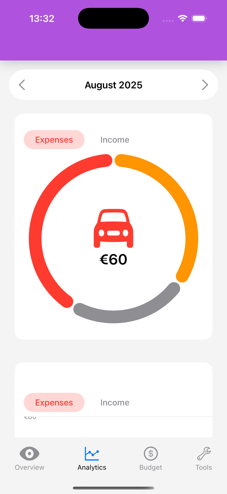
  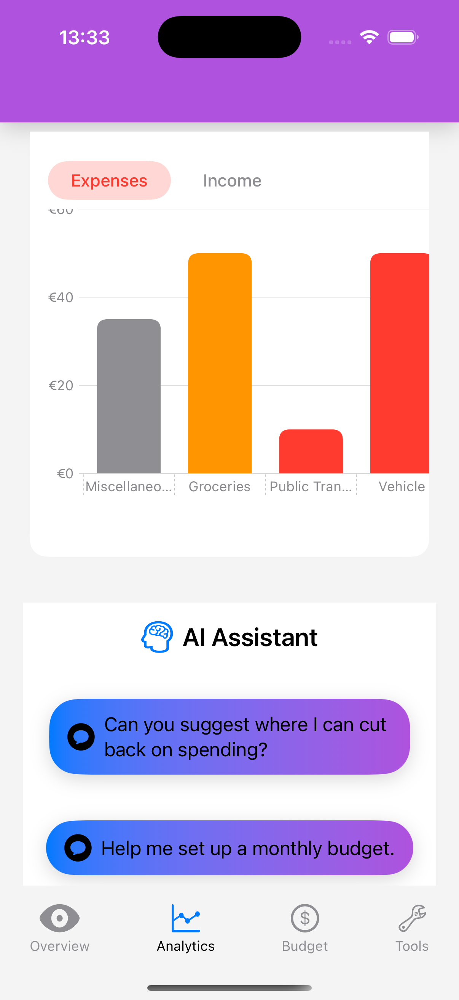
  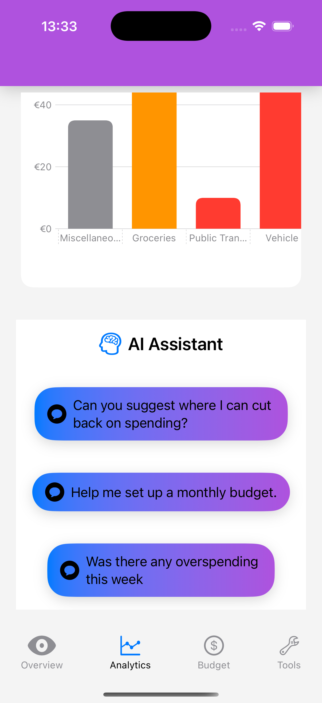

#### Budget Management

  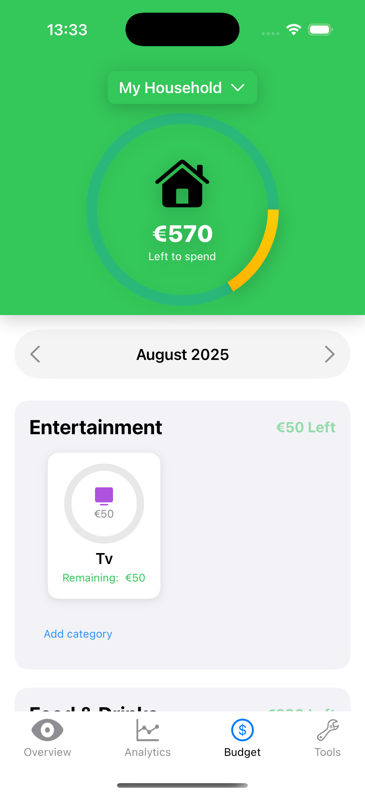
  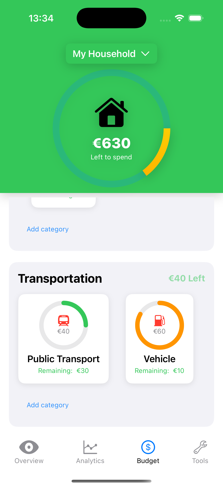
  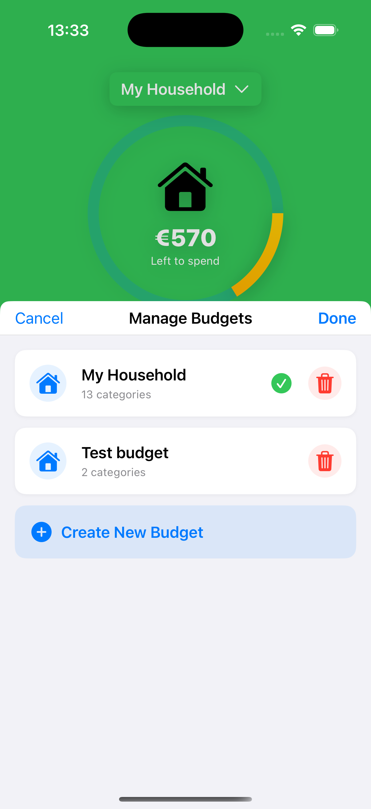

#### Chat Bot

  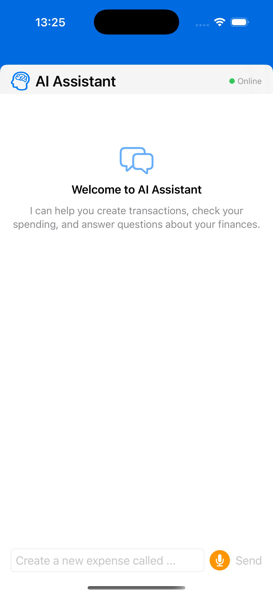
  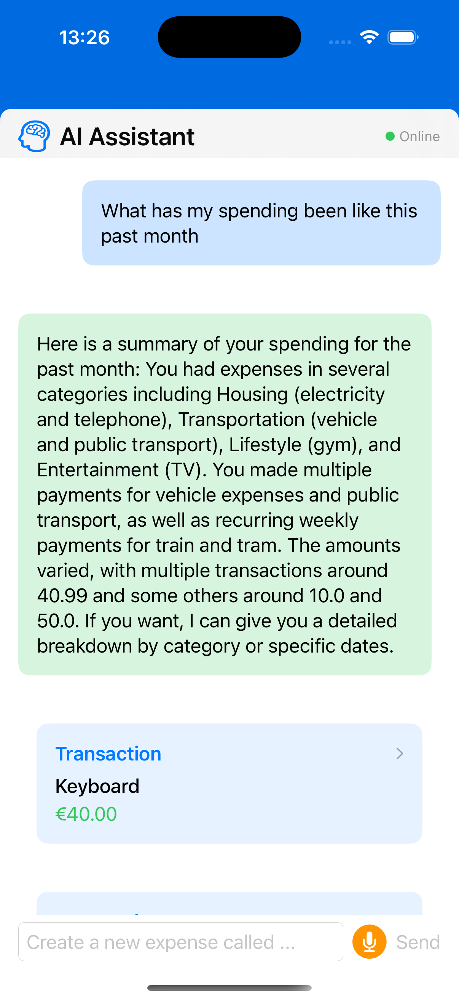

#### Recurring Transactions

  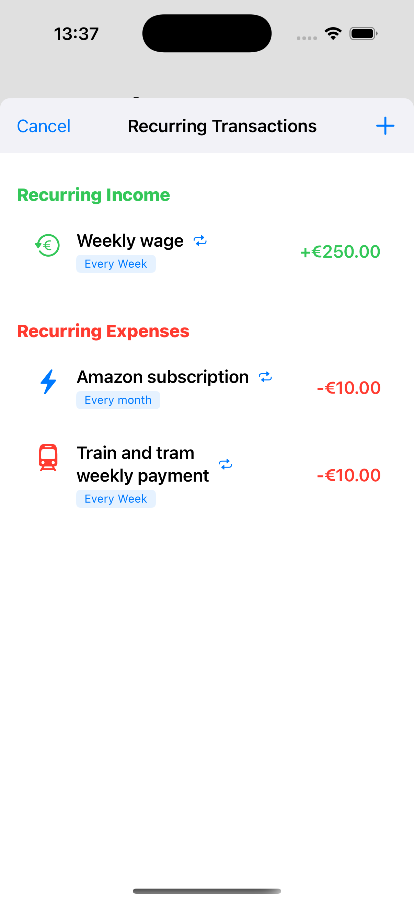

#### Tools

  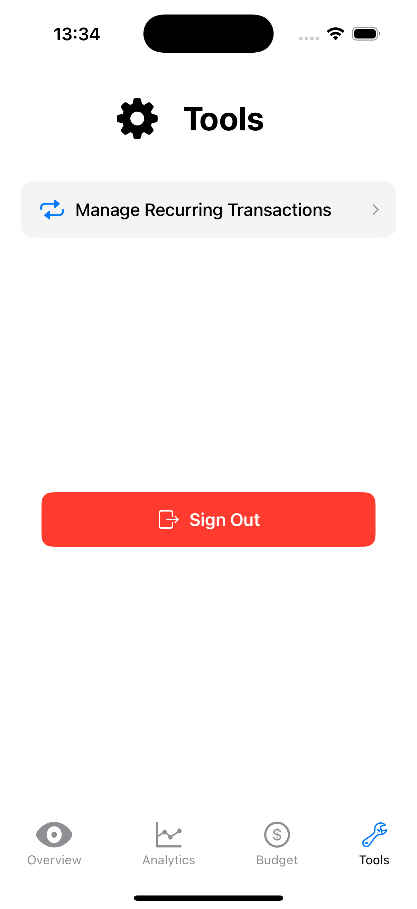

## Contact
#### Afolabi Adekanle - afolabiadekanle@gmail.com - [![linkedin][linked-in]][LinkedIn-url]

[Swift]:https://img.shields.io/badge/Swift-F05138?logo=swift&logoColor=white
[Swift-url]:https://www.swift.org/
[Python.py]:https://img.shields.io/badge/python-3670A0?style=for-the-badge&logo=python&logoColor=ffdd54
[Python-url]:https://www.python.org/
[Postgresql]:https://img.shields.io/badge/postgresql-4169e1?style=for-the-badge&logo=postgresql&logoColor=white
[Postgresql-url]:https://www.postgresql.org/
[linked-in]: https://img.shields.io/badge/LinkedIn-0077B5?style=for-the-badge&logo=linkedin&logoColor=white
[LinkedIn-url]: https://www.linkedin.com/in/afolabi-adekanle-68428b1b6/
[SpringBoot]:https://img.shields.io/badge/SpringBoot-6DB33F?style=flat-square&logo=Spring&logoColor=white
[SpringBoot-url]:https://spring.io/
[Java]:https://img.shields.io/badge/Java-ED8B00?style=for-the-badge&logo=openjdk&logoColor=white
[Java-url]:https://www.java.com/en/
